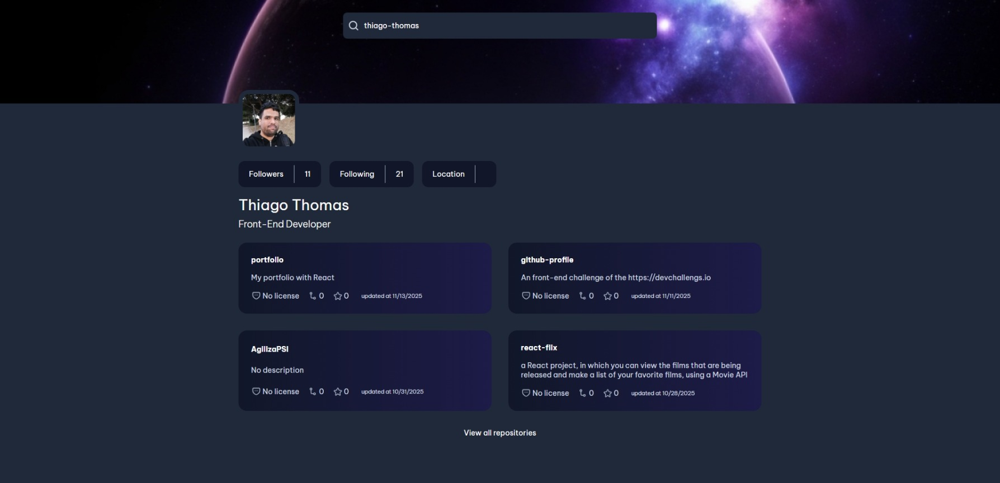

<!-- Please update value in the {}  -->

<h1 align="center">GitHub Profile | devChallenges</h1>

   Solution for a challenge <a href="https://devchallenges.io/challenge/github-profile" target="_blank">GitHub Profile</a> from <a href="http://devchallenges.io" target="_blank">devChallenges.io</a>.

  <h3>
    <a href="https://github-profile-thiago-thomas.netlify.app/">
      Demo
    </a>
     | 
    <a href="https://github.com/thiago-thomas/github-profile">
      Solution
    </a>
     | 
    <a href="https://devchallenges.io/challenge/github-profile">
      Challenge
    </a>
  </h3>

<!-- TABLE OF CONTENTS -->

## Table of Contents

- [Overview](#overview)
  - [What I learned](#what-i-learned)
  - [Useful resources](#useful-resources)
- [Built with](#built-with)
- [Features](#features)
- [Contact](#contact)
- [Acknowledgements](#acknowledgements)

<!-- OVERVIEW -->

## Overview

<!--
Introduce your projects by taking a screenshot or a gif. Try to tell visitors a story about your project by answering:

- What have you learned/improved?
- Your wisdom? :)
-->

### What I learned

- Integrating with external APIs (GitHub API) to fetch real-time user and repository data
- Building a responsive React application with TypeScript for type safety
- Managing async operations and loading states with React hooks
- Creating reusable components for displaying complex data (user profiles, repositories)
- Handling error scenarios gracefully in API calls
- Implementing pagination and "View All" functionality for large datasets
- Working with Vite as a modern build tool with fast development server

### Useful resources

- [GitHub REST API Documentation](https://docs.github.com/en/rest) - Official documentation for GitHub API endpoints used to fetch user and repository data
- [React Hooks Documentation](https://react.dev/reference/react) - Essential for understanding useState and useEffect hooks used in this project
- [TypeScript Handbook](https://www.typescriptlang.org/docs/) - Helps understand type definitions and interfaces
- [Vite Documentation](https://vitejs.dev/) - Build tool and development server used in this project

### Built with

- Semantic HTML5 markup
- CSS custom properties
- Flexbox
- CSS Grid
- [React 19](https://react.dev/) - JavaScript library for building user interfaces
- [TypeScript](https://www.typescriptlang.org/) - Typed superset of JavaScript for better code quality
- [Vite 7](https://vitejs.dev/) - Next generation frontend build tool
- [GitHub REST API](https://docs.github.com/en/rest) - For fetching user and repository data

## Features

- **GitHub User Search** - Search and display any GitHub user's profile information
- **User Profile Display** - Shows user avatar, name, bio, followers, following count, and location
- **Repository Listing** - Displays user repositories with details including:
  - Repository name and description
  - Star count
  - Fork count
  - License information
  - Last update date
- **Sorted Repositories** - Repositories are sorted by most recently updated first
- **Repository Pagination** - View limited repositories initially with option to load all repositories
- **Responsive Design** - Fully responsive layout that works on desktop and mobile devices

This application/site was created as a submission to a [DevChallenges](https://devchallenges.io/challenges-dashboard) challenge.

## Acknowledgements

- [DevChallenges](https://devchallenges.io/) - For providing the design and challenge requirements
- [GitHub](https://github.com/) - For the comprehensive and well-documented REST API
- The React and TypeScript communities for excellent documentation and resources

## Author

- GitHub [@thiago-thomas](https://github.com/thiago-thomas)
